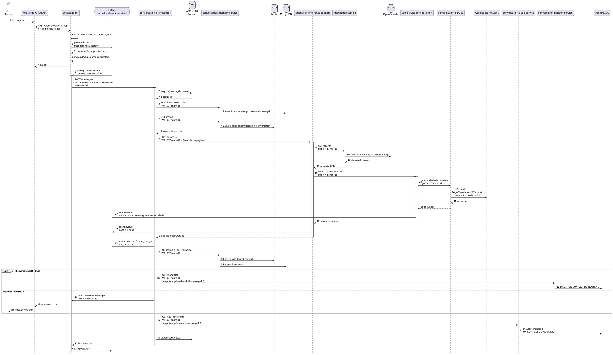
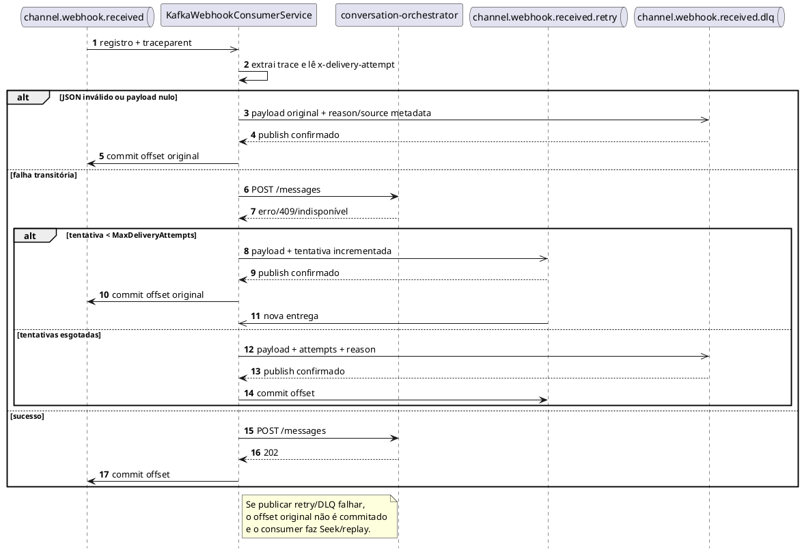

# Diagramas de sequência — estado implementado P1

Os diagramas abaixo descrevem somente código implementado. A arquitetura-alvo está separada em `C4/c4-container-target.puml`.

## 1. Processamento normal

## 2. Retry transitório e DLQ

## 3. Garantias e limites

| Aspecto | Garantia implementada |
|---|---|
| Entrada WhatsApp | ACK somente depois do Kafka confirmar |
| Dedupe BFF | `pending` antes do Kafka; `completed` depois da confirmação |
| Dedupe Orchestrator | Inbox PostgreSQL com lease e estados |
| Side effects | Audit/Handoff com `Idempotency-Key` |
| Kafka poison | DLQ com payload e metadados de origem |
| Trace Kafka | `traceparent`/`tracestate` propagados e extraídos |
| Tenant | JWT identifica workload; `X-Tenant-Id` acompanha todas as chamadas |
| Sessão | chave Redis inclui tenant |
| RAG | índice físico OpenSearch por tenant |

Limites atuais:

- Core mock recebe JWT, mas não o valida.
- Handoff persiste o pedido, mas não transfere para uma plataforma humana real.
- Eventos de observabilidade sem consumer funcional continuam sendo trilha assíncrona, não integração de negócio.
