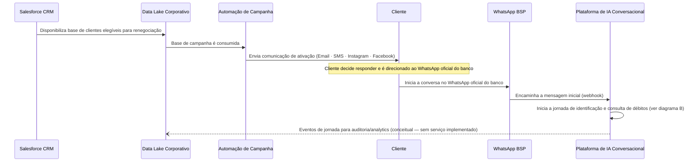

# Diagramas de sequência da jornada

Do gatilho de campanha até a consulta de débitos e elegibilidade: como uma mensagem do WhatsApp atravessa o `whatsapp-bff`, o `conversation-orchestrator`, o agente Strands/Bedrock, o servidor MCP e o Core Bancário mock.

## Legenda

| Notação | Significado |
|---|---|
| `A->>B` | Chamada síncrona (HTTP ou MCP) |
| `A-->>B` | Retorno / resposta a uma chamada síncrona |
| `A--)B` | Evento assíncrono (publish no Kafka, fire-and-forget) |
| `A->>A` | Processamento interno (self-call) |
| `Note` | Observação — comportamento não óbvio a partir do código |
| `loop` / `alt` | Fragmento que se repete ou depende de uma condição |

**Conceitual** = descrito em [`business-context.md`](../context/business-context.md) / [C4 nível 1](c4-context.md), sem componente técnico implementado neste workspace.
**Implementado** = verificado no código e nas specs (endpoints, portas e tópicos reais); ver [`runbook.md`](../runbook.md) para subir o ambiente local.

---

## A · Entrada por campanha (conceitual)

Salesforce CRM → Data Lake → Automação de Campanha → Cliente → WhatsApp. Nenhum destes componentes existe como código neste workspace — é o gatilho de negócio que antecede o diagrama B.



---

## B · Identificação do cliente & consulta de débitos/elegibilidade (implementado)

Verificado no código e nas specs OpenSpec. Portas conforme o [`runbook.md`](../runbook.md) — os valores em `launchSettings.json` do Visual Studio não são usados na execução real.

> A entrada via Kafka (`channel.webhook.received` → `KafkaWebhookConsumerService`) substituiu a antiga fila em memória entre o webhook e o Orchestrator: a durabilidade agora sobrevive a um restart/crash do `whatsapp-bff`, e uma indisponibilidade do Orchestrator vira retry com backpressure em vez de perda de mensagem.

```mermaid
sequenceDiagram
    participant Cliente
    participant BSP as WhatsApp BSP
    participant BFF as whatsapp-bff
    participant Kafka
    participant Orch as conversation-orchestrator
    participant Agent as agent-runtime-renegotiation
    participant Tool as tool-service-renegotiation
    participant Reneg as renegotiation-service
    participant Core as core-bancario-mock

    Cliente->>BSP: Envia mensagem (texto ou resposta interativa)
    BSP->>BFF: POST /webhooks/whatsapp (assinado X-Hub-Signature-256)
    BFF->>BFF: Valida HMAC-SHA256, deduplica por messageId
    BFF->>Kafka: Publica channel.webhook.received (payload bruto, chave = telefone)
    BFF-->>BSP: 200 OK (503 se o Kafka recusar a publicação)
    Note over BFF,Kafka: KafkaWebhookConsumerService (BackgroundService no mesmo processo) consome o tópico de forma assíncrona
    Kafka-->>BFF: Entrega channel.webhook.received ao consumer
    BFF->>Orch: POST /messages (MessageId, From, ConversationId, Type, Text)
    Note right of BFF: commit do offset só ocorre se o forward tiver sucesso;<br/>se falhar, dá Seek de volta ao mesmo offset e retenta a cada ~2s
    Orch->>Orch: Cria ou recupera a sessão da conversa (TTL 30 min, em memória)
    Orch->>Agent: POST /process (ConversationId, JourneyStage, LastIntent, Text)
    Agent->>Tool: MCP list_tools() (streamable-HTTP · /mcp)

    loop uma chamada MCP para cada dado que o agente precisa confirmar
        Agent->>Tool: call consultar_cliente(cpf)
        Tool->>Reneg: GET /clients/{cpf}
        Reneg->>Core: ClientApi (:9401)
        Core-->>Reneg: 200 OK · dados do cliente
        Reneg-->>Tool: 200 OK (sempre 200 — mesmo se o cliente não for encontrado)
        Tool--)Kafka: tool.executed (CPF mascarado)
        Tool-->>Agent: resultado: consultar_cliente

        Agent->>Tool: call consultar_contratos(clientId)
        Tool->>Reneg: GET /clients/{clientId}/contracts
        Reneg-->>Tool: 200 OK · contratos
        Tool--)Kafka: tool.executed
        Tool-->>Agent: resultado: consultar_contratos

        Agent->>Tool: call consultar_débitos(contractId)
        Tool->>Reneg: GET /contracts/{contractId}/debts
        Reneg-->>Tool: 200 OK · débitos em aberto
        Tool--)Kafka: tool.executed
        Tool-->>Agent: resultado: consultar_débitos

        Agent->>Tool: call validar_elegibilidade(contractId)
        Tool->>Reneg: GET /contracts/{contractId}/eligibility
        Reneg->>Core: EligibilityApi (:9402)
        Core-->>Reneg: 200 OK · eligible / reason
        Reneg-->>Tool: 200 OK (502 só se o Core Bancário estiver realmente inacessível)
        Tool--)Kafka: tool.executed
        Tool-->>Agent: resultado: validar_elegibilidade
    end

    Agent--)Kafka: agent.events (intent, confidence, requires_handoff)
    Agent-->>Orch: 200 OK (Intent, Confidence, ReplyText, RequiresHandoff)
    Orch--)Kafka: intent.detected + conversation.state_changed

    alt RequiresHandoff = false
        Orch->>BFF: POST /internal/messages (To, Type: text, Text: replyText)
        BFF->>BSP: POST /{phone-number-id}/messages (Graph API)
        BSP->>Cliente: Entrega a resposta (débitos elegíveis apresentados)
    end
```

---

## Serviços, tópicos e lacunas conhecidas

| Serviço | Stack | Porta (dev) |
|---|---|---|
| whatsapp-bff | .NET 8 · Minimal API | `5153` |
| conversation-orchestrator | .NET 8 · Minimal API | `8000` |
| agent-runtime-renegotiation | Python · FastAPI · Strands + Bedrock | `8100` |
| tool-service-renegotiation | Python · MCP (FastMCP) | `8400` |
| renegotiation-service | .NET 8 · Minimal API | `9400` |
| core-bancario-mock | .NET 8 · 4 APIs mock | `9401`–`9404` |

**Tópicos Kafka observados:** `channel.webhook.received`, `channel.message.received`, `channel.message.status`, `tool.executed`, `agent.events`, `intent.detected`, `conversation.state_changed`.

**Lacunas / contratos assumidos** (sem implementação neste workspace):

- **Handoff Service** (`:8200`) — cliente HTTP existe no orchestrator com contrato assumido.
- **Audit Service** (`:8300`) — mesma situação; registra jornada mas não há endpoint real.
- **Knowledge Service / RAG** (`:8500`) — usado pelo agente para `search_knowledge_base`; formato de resposta é assumido, sem verificação.
- **Salesforce CRM / Data Lake** — existem apenas nos documentos de arquitetura; nenhum código do repositório modela essa integração.

Toda a cadeia é resiliente por desenho: falhas downstream nunca derrubam o serviço upstream — degradam para handoff (agente) ou `502` (renegotiation-service, apenas quando o Core Bancário está genuinamente inacessível).
