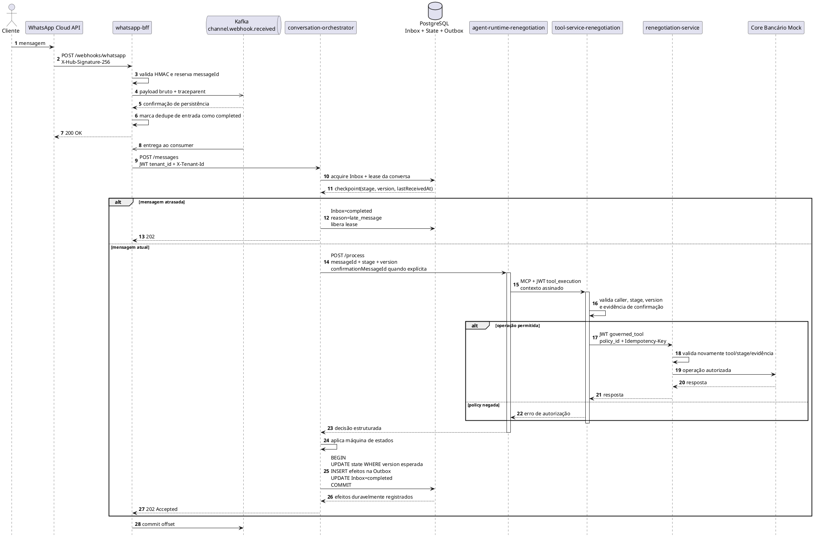
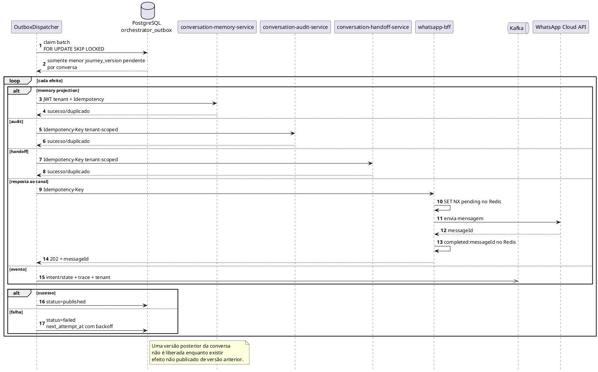
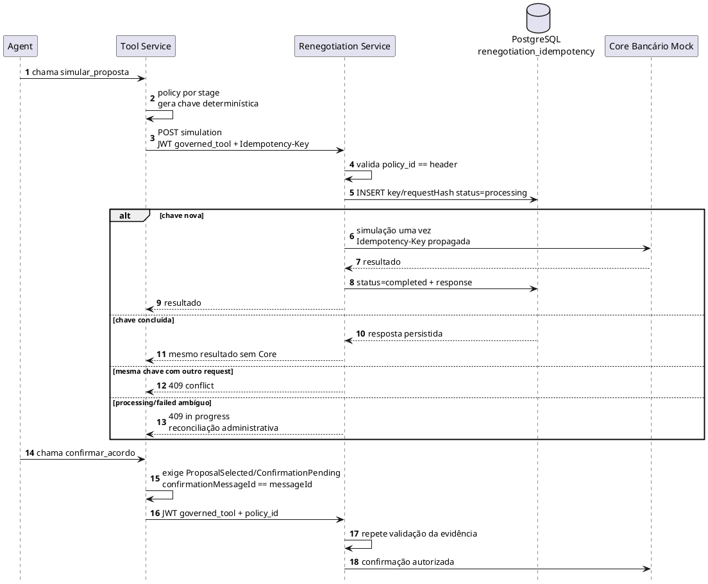
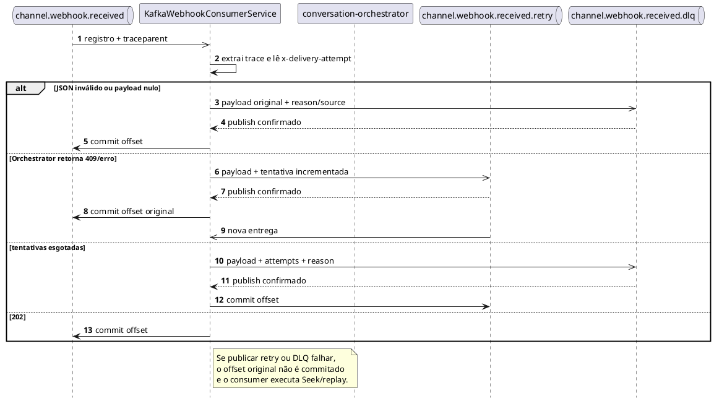

# Diagramas de sequência — estado implementado P0/P1

Os diagramas abaixo descrevem somente o código implementado. A arquitetura-alvo permanece separada em `C4/c4-container-target.puml`.

## 1. Aceite da mensagem e persistência transacional

## 2. Dispatcher da Outbox

## 3. Idempotência de simulação e confirmação

## 4. Retry de entrada e DLQ

## 5. Garantias e limites

| Aspecto | Garantia implementada |
|---|---|
| Entrada WhatsApp | ACK somente depois de Kafka confirmar persistência |
| Conclusão do Inbox | Apenas após estado e efeitos serem gravados na mesma transação |
| Side effects | Outbox at-least-once + deduplicação no destino |
| Ordenação | lease por conversa, versão otimista, late-message detection e barrier na Outbox |
| Tenant | UUID canônico presente no header e em claim JWT assinada |
| Tools | allowlist por estágio e policy proof validada no Tool e no serviço de domínio |
| Simulação | resultado persistido por tenant/key/hash; replay sem Core |
| Confirmação | exige evidência assinada ligada à mensagem atual |
| Memória | unicidade `(tenantId, externalMessageId)` |
| Audit/Handoff | unicidade `(tenant_id, idempotency_key)` |

Limites atuais:

- o Core Bancário Mock não está disponível para implementação da validação de JWT e idempotência no último salto;
- por isso, simulações ambíguas falham fechadas e exigem reconciliação administrativa;
- Handoff ainda persiste o pedido, sem transferir para plataforma humana real;
- o HS256 compartilhado continua sendo solução de POC endurecida;
- build, migração em volume existente e E2E precisam ser executados antes do merge.
