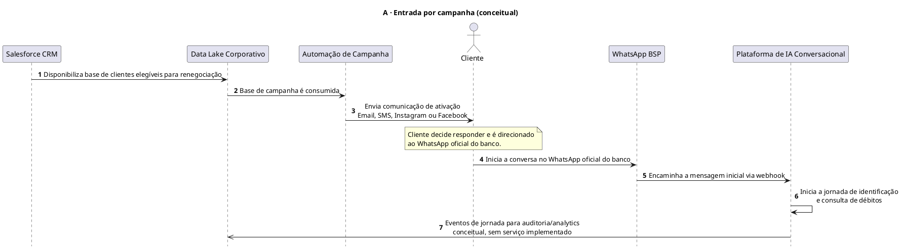
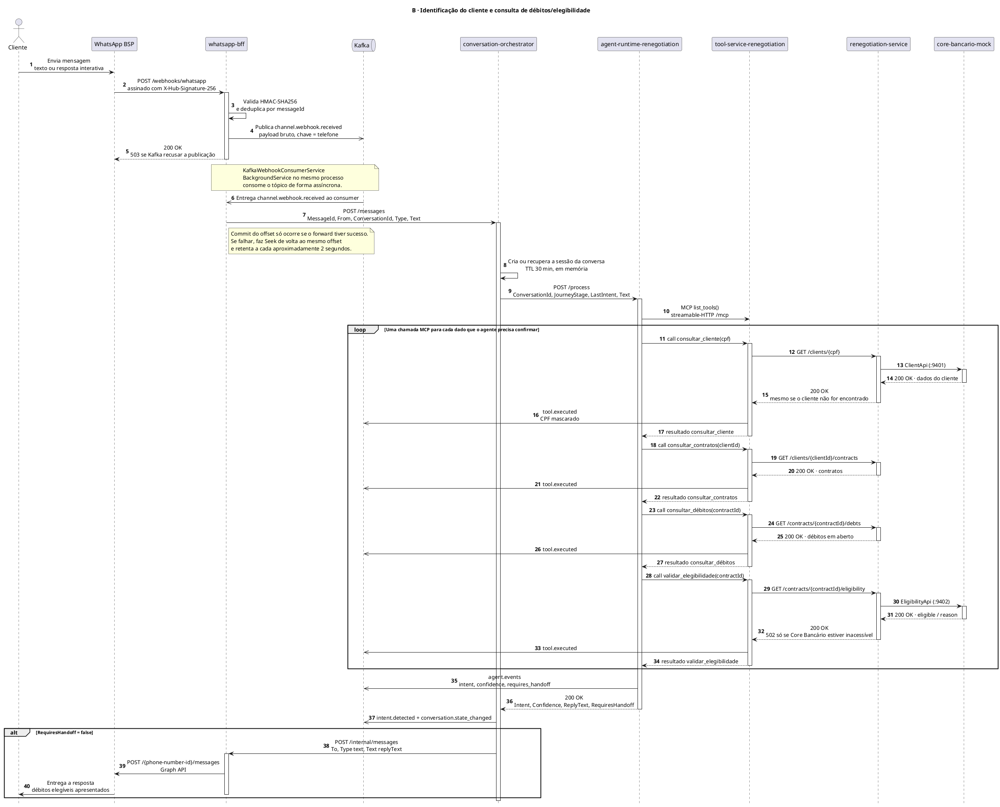

# Diagramas de sequência da jornada

Do gatilho de campanha até a consulta de débitos e elegibilidade: como uma mensagem do WhatsApp atravessa o `whatsapp-bff`, o `conversation-orchestrator`, o agente Strands/OpenAI, o servidor MCP e o Core Bancário mock.

## Legenda

| Notação | Significado |
|---|---|
| `->` | Chamada síncrona (HTTP ou MCP) |
| `-->` | Retorno / resposta a uma chamada síncrona |
| `->>` | Evento assíncrono / publicação Kafka |
| `activate` / `deactivate` | Janela de processamento interno |
| `note` | Observação — comportamento não óbvio a partir do código |
| `loop` / `alt` | Fragmento que se repete ou depende de uma condição |

**Conceitual** = descrito em [`business-context.md`](../context/business-context.md) / [C4 nível 1](c4-context.md), sem componente técnico implementado neste workspace.
**Implementado** = verificado no código e nas specs (endpoints, portas e tópicos reais); ver [`runbook.md`](../runbook.md) para subir o ambiente local.

---

## A · Entrada por campanha (conceitual)

Salesforce CRM → Data Lake → Automação de Campanha → Cliente → WhatsApp. Nenhum destes componentes existe como código neste workspace — é o gatilho de negócio que antecede o diagrama B.

---

## B · Identificação do cliente & consulta de débitos/elegibilidade (implementado)

Verificado no código e nas specs OpenSpec. Portas conforme o [`runbook.md`](../runbook.md) — os valores em `launchSettings.json` do Visual Studio não são usados na execução real.

> A entrada via Kafka (`channel.webhook.received` → `KafkaWebhookConsumerService`) substituiu a antiga fila em memória entre o webhook e o Orchestrator: a durabilidade agora sobrevive a um restart/crash do `whatsapp-bff`, e uma indisponibilidade do Orchestrator vira retry com backpressure em vez de perda de mensagem.

---

## Serviços, tópicos e lacunas conhecidas

| Serviço | Stack | Porta (dev) |
|---|---|---|
| whatsapp-bff | .NET 8 · Minimal API | `5153` |
| conversation-orchestrator | .NET 8 · Minimal API | `8000` |
| agent-runtime-renegotiation | Python · FastAPI · Strands + OpenAI | `8100` |
| tool-service-renegotiation | Python · MCP (FastMCP) | `8400` |
| renegotiation-service | .NET 8 · Minimal API | `9400` |
| core-bancario-mock | .NET 8 · 4 APIs mock | `9401`–`9404` |

> Portas de "dev local" (`dotnet run`/`uvicorn`, seção 3 do [`runbook.md`](../runbook.md)). Via `docker compose up -d`, `conversation-orchestrator` e `renegotiation-service` são expostos no host em portas diferentes (`5268` e `5266` — hardcoded em `docker-compose.yml`); ver a tabela completa em [`runbook.md` § Mapa de portas](../runbook.md#mapa-de-portas--resumo). A comunicação serviço-a-serviço usa sempre a rede interna do Docker, então esse detalhe só importa para quem testa via `curl` do host.

**Tópicos Kafka observados:** `channel.webhook.received`, `channel.message.received`, `channel.message.status`, `tool.executed`, `agent.events`, `intent.detected`, `conversation.state_changed`.

**Lacunas / contratos assumidos** (sem implementação neste workspace):

- **Knowledge Service / RAG** (`:8500`) — usado pelo agente para `search_knowledge_base`; formato de resposta é assumido, sem verificação.
- **Salesforce CRM / Data Lake** — existem apenas nos documentos de arquitetura; nenhum código do repositório modela essa integração.

> **Audit Service** (`:8300`, `conversation-audit-service`) deixou de ser uma lacuna: validado em 2026-07-13 como mock com a chamada do Orchestrator comentada ([relatório](../validation/2026-07-13-e2e-journey.md)), o serviço real foi implementado e integrado em 2026-07-18 — `conversation-orchestrator` já chama `POST /journey-events` de verdade ao fim de cada mensagem processada. Ver [`docs/services/conversation-orchestrator.md`](../services/conversation-orchestrator.md#dependências-síncronas).
>
> **Handoff Service** (`:8200`, `conversation-handoff-service`) também deixou de ser uma lacuna: diferente do Audit Service, a chamada do Orchestrator (`POST /handoffs`) nunca esteve comentada — ela só falhava sempre porque apontava para um host sem backend. Implementado e integrado em 2026-07-18: agora aponta para o `conversation-handoff-service` real, e o timeout artificialmente curto que existia só por causa da indisponibilidade permanente foi removido. Ver [`docs/services/conversation-orchestrator.md`](../services/conversation-orchestrator.md#dependências-síncronas).

Toda a cadeia é resiliente por desenho: falhas downstream nunca derrubam o serviço upstream — degradam para handoff (agente) ou `502` (renegotiation-service, apenas quando o Core Bancário está genuinamente inacessível).
