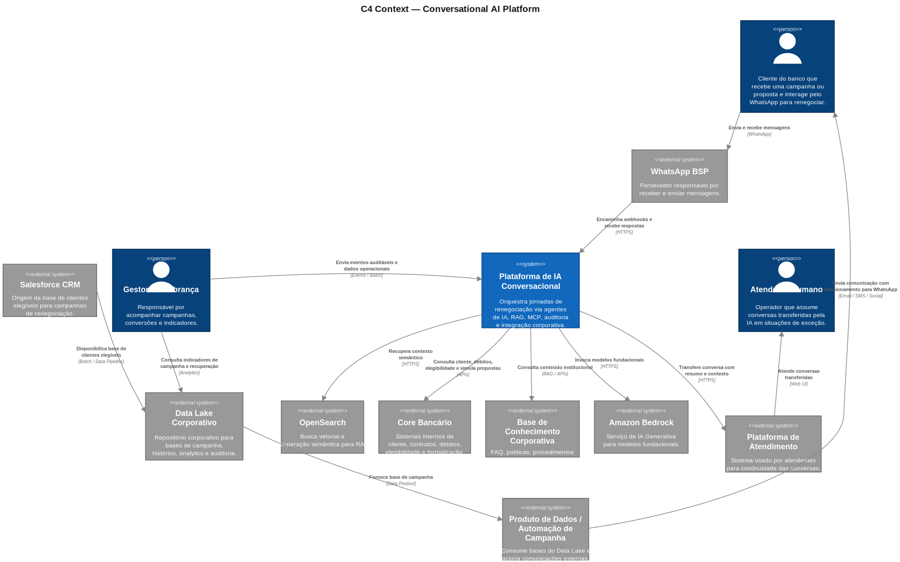

# Conversational AI Platform Architecture

Arquitetura de referência para plataformas corporativas de IA conversacional com agentes, MCP, RAG, WhatsApp, sistemas transacionais e observabilidade ponta a ponta.

[:material-sitemap-outline: Explorar a arquitetura](architecture/c4-context.md){ .md-button .md-button--primary }
[:material-github: Ver o repositório](https://github.com/leandrosflora/conversational-ai-platform-architecture){ .md-button }

## Visão arquitetural

## Capacidades centrais

-   :material-robot-outline:{ .lg .middle } **Orquestração de agentes**

    ---

    O runtime interpreta a intenção, mantém contexto e coordena ferramentas governadas para executar a jornada.

    [Agent Runtime](services/agent-runtime-renegotiation.md)

-   :material-tools:{ .lg .middle } **MCP governado**

    ---

    Tool calling com autorização por estágio, separação de responsabilidades e contratos explícitos.

    [Tool Service MCP](services/tool-service-renegotiation.md)

-   :material-database-search-outline:{ .lg .middle } **RAG e memória**

    ---

    Conhecimento vetorial, memória de curto e longo prazo e isolamento por tenant sustentam respostas contextualizadas.

    [Knowledge Service](services/knowledge-service.md)

-   :material-shield-check-outline:{ .lg .middle } **Segurança e auditoria**

    ---

    HMAC, JWT interno por par de serviços, idempotência, trilha imutável e handoff humano protegem a operação.

    [Arquitetura de segurança](security/security-architecture.md)

## Jornada conversacional

| Etapa | Responsabilidade |
|---|---|
| Entrada | WhatsApp BFF valida o webhook e garante uma entrada durável |
| Orquestração | Conversation Orchestrator controla contexto, Inbox e Outbox |
| Raciocínio | Agent Runtime decide a próxima ação da jornada |
| Ferramentas | Tool Service MCP aplica governança às chamadas transacionais |
| Negociação | Renegotiation Service consulta elegibilidade e simula propostas |
| Suporte | Memória, conhecimento, auditoria e handoff completam a experiência |

[Ver diagramas de sequência](architecture/sequence-diagrams.md){ .md-button }

## Stack e padrões

| Capacidade | Tecnologia ou padrão |
|---|---|
| Serviços | .NET, arquitetura hexagonal, APIs REST |
| Agentes | Runtime de agente e MCP para ferramentas |
| Mensageria | Kafka, Inbox/Outbox e idempotência |
| Conhecimento | OpenSearch com busca vetorial |
| Estado | PostgreSQL, MongoDB e Redis |
| Segurança | HMAC, JWT interno e autorização de tools |
| Observabilidade | OpenTelemetry, Prometheus, Grafana, Loki e Jaeger |
| Execução local | Docker Compose e Postman |

!!! success "Arquitetura executável"
    Além dos diagramas e contratos, o projeto registra validações E2E reais da jornada, incluindo consistência, hardening e autenticação interna por serviço.